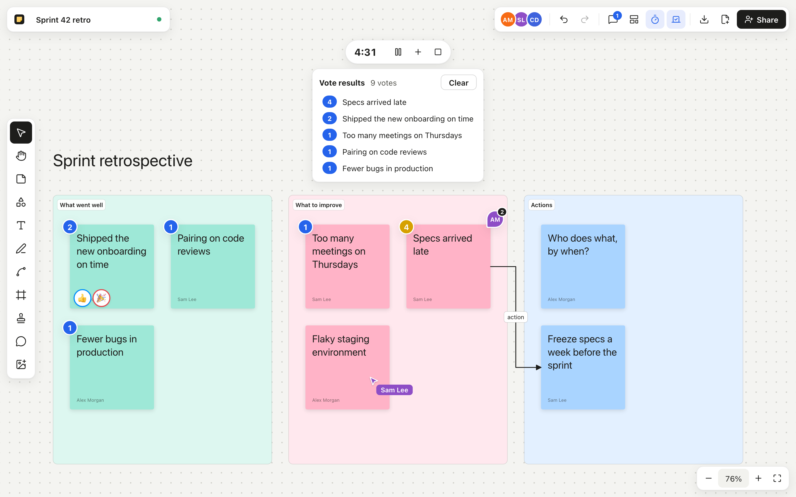

# Myoboard

An open-source, self-hostable collaborative whiteboard: sticky notes, shapes,
connectors, sections, a pen, reaction stamps and live cursors, synced in real
time between everyone on the same board.



## Features

- **Infinite canvas**: scroll or Space-drag to pan, Ctrl/⌘ + scroll (or pinch) to zoom, zoom to fit.
- **Objects**: sticky notes (8 colours, text that shrinks to fit, author name),
  10 shapes with labels (rectangle, pill, ellipse, diamond, triangle,
  hexagon, parallelogram, arrow, star, cylinder), free text, pen strokes,
  images, sections that carry their content when moved, reaction stamps.
- **Connectors**: attached to objects (they meet each shape's real outline),
  straight, elbow or curved, with a label and arrowheads at either end.
- **Images**: add PNG, JPEG, GIF or WebP pictures from the toolbar, by
  dropping files on the board or by pasting a screenshot.
- **Editing**: click, Shift-click or drag a box to select; move, resize,
  recolour, duplicate, bring to front, delete; undo and redo (your own edits
  only); copy, cut and paste within a board, between boards and from other
  apps (a pasted list becomes one sticky note per line).
- **Real time**: everyone on the board sees edits as they happen (text
  included), named cursors, who is here, and what others have selected.
- **Resilient**: every board is saved on the server and kept in the browser
  (IndexedDB), so it opens instantly and keeps working through a dropped
  connection.
- **Accounts and permissions**: sign in with your company's Google or
  Microsoft account (OpenID Connect). Each board has an owner who invites
  people as editors or viewers and decides what the link gives everyone
  else: nothing, viewing or editing. Viewers see changes live but can
  change nothing, enforced by the server.
- **Your boards**: one page lists the boards you own, were invited to or
  opened, with search and filters, and starts new boards from templates.
- **Workshops**: comments pinned to the board or to a note, with replies
  and resolving; templates (retrospective, brainstorm, kanban, and your
  team's own, saved from any board); a shared timer everyone sees; voting
  sessions with a number of votes per person, results hidden until the end.
- **Sharing and export**: one link per board, editable title, export of the
  whole board or the selection as PNG, JPG or PDF.
- Pans at a median 60 fps with 500 sticky notes, at every zoom level,
  measured in headless Chromium and in Chrome on macOS (see [Tests](#tests)).

## Run it

Requires Node.js 22.13 or newer on the 22 line, 24, or 26 and newer.

```bash
npm ci
npm start
```

`npm start` builds the app and serves it, with real-time sync, on
<http://localhost:3000>. Without further setup you sign in with a name and an
email, which nobody checks: fine to try it on your machine. Before sharing
the server, connect your company's accounts (next section).

| Flag           | Variable     | Default   | Purpose                                                   |
| -------------- | ------------ | --------- | --------------------------------------------------------- |
| `--port`       | `PORT`       | `3000`    | HTTP and WebSocket port                                   |
| `--host`       | `HOST`       | `0.0.0.0` | Interface to listen on; `127.0.0.1` keeps it local        |
| `--data-dir`   | `DATA_DIR`   | `./data`  | Where boards, accounts and images are saved               |
| `--public-url` | `PUBLIC_URL` | (none)    | The address people use, e.g. `https://board.example.com`  |

Pass flags after `--`, as in `npm start -- --port 4000`.

For development, `npm run dev` runs Vite with hot reload on
<http://localhost:5173> and the API and sync server on port 1234.

### Run it with Docker

```bash
docker compose up -d
```

builds the image and serves Myoboard on <http://localhost:3000>, with its
data in a Docker volume (`/data` in the container). Edit `compose.yaml` to
set `PUBLIC_URL` and the `OIDC_*` variables below, and put HTTPS in front
of it (a reverse proxy such as Caddy, nginx or your company's load
balancer). The image runs as an unprivileged user and reports its health
on `/healthz`.

### Sign in with your company's accounts

Myoboard speaks OpenID Connect, so it works with Google Workspace, Microsoft
Entra ID (Office 365) or any other OIDC provider. Nobody has a password to
manage. Register Myoboard as a web application with your provider, with
`<PUBLIC_URL>/auth/callback` as the redirect URI, then set:

| Variable               | Purpose                                                                 |
| ---------------------- | ----------------------------------------------------------------------- |
| `OIDC_ISSUER`          | Google: `https://accounts.google.com`; Microsoft: `https://login.microsoftonline.com/<tenant id>/v2.0` |
| `OIDC_CLIENT_ID`       | From your provider                                                      |
| `OIDC_CLIENT_SECRET`   | From your provider                                                      |
| `OIDC_ALLOWED_DOMAINS` | Optional, comma-separated: only these email domains get in, e.g. `example.com` |
| `OIDC_PROVIDER_NAME`   | Optional: the sign-in button says "Continue with …"; guessed for Google and Microsoft |
| `PUBLIC_URL`           | The address people use; it must match the redirect URI you registered  |

- **Google**: in Google Cloud Console, *APIs & Services → Credentials →
  Create OAuth client ID → Web application*. Set the consent screen to
  *Internal* so only your Workspace accounts can sign in.
- **Microsoft**: in the Entra admin centre, *App registrations → New
  registration*, single tenant, redirect URI of type *Web*; then create a
  client secret under *Certificates & secrets*.

With a single-tenant Microsoft app or an internal Google app, only your
company's accounts can sign in; `OIDC_ALLOWED_DOMAINS` adds a second check.

## Keyboard shortcuts

| Key                        | Action                            |
| -------------------------- | --------------------------------- |
| `V` / `H`                  | Select / hand (pan)               |
| `S` / `R` / `T`            | Sticky note / shape / text        |
| `P` / `C` / `F` / `E`      | Pen / connector / section / stamp |
| `M`                        | Comment                           |
| Space + drag               | Pan with any tool                 |
| Enter or double-click      | Edit the selected object's text (a connector's label) |
| Esc                        | Finish editing, clear selection   |
| Delete / Backspace         | Delete the selection              |
| Ctrl/⌘ Z, Ctrl/⌘ Shift Z   | Undo, redo                        |
| `I`                        | Add an image                      |
| Ctrl/⌘ C / X / V           | Copy / cut / paste                |
| Ctrl/⌘ D                   | Duplicate                         |
| Ctrl/⌘ A                   | Select all                        |
| Ctrl/⌘ + / − / 0, Shift 1  | Zoom in / out / 100% / fit        |

## How it works

```text
browser                                        server (one Node process)
┌──────────────────────────────┐   WebSocket   ┌────────────────────────────┐
│ React UI + Konva canvas      │◀─────────────▶│ /ws/<board>: y-websocket   │
│ Board model (Yjs document)   │               │ protocol, presence relay   │
│ IndexedDB copy (y-indexeddb) │               │ boards saved in DATA_DIR   │
└──────────────────────────────┘               └────────────────────────────┘
```

- **Document model** (`src/model`): a board is a flat map of objects, and
  each object is a map of properties. Comments, the timer and votes live
  in the same Yjs document, outside undo. Concurrent edits merge property by
  property (last writer wins), so two people moving and recolouring the same
  sticky never conflict. A fractional `index` orders objects back to front.
  Built on [Yjs](https://github.com/yjs/yjs).
- **Server** (`server/`): one Node process serves the built app, the JSON
  API under `/api`, board images under `/media`, sign-in under `/auth` and
  the y-websocket protocol on `/ws/<board>`. It relays presence (cursors,
  selections) and saves each board as a Yjs update file. Accounts,
  sessions, board owners, invitations and team templates live in a SQLite
  database (`DATA_DIR/myoboard.db`, Node's built-in `node:sqlite`). Board
  ids are restricted to a safe alphabet because they become file names.
- **Permissions**: the server checks your role when the WebSocket opens.
  It never applies edits sent by a viewer, and when an owner changes
  someone's access it disconnects them so they come back with their new
  role.
- **Canvas** (`src/canvas`): [Konva](https://konvajs.org) through
  react-konva. Only objects near the screen are drawn, and text is skipped
  when zoomed out too far to read.
- **UI** (`src/ui`): toolbar, context bar, top bar and zoom controls, with
  [Lucide](https://lucide.dev) icons.

## Tests

```bash
npm run typecheck
npm test            # unit tests + sync server tests with real WebSocket clients
npm run test:e2e    # Playwright: builds the app and drives real browsers
```

The server tests cover accounts, permissions (including a viewer trying
to edit through the sync protocol), images and a complete OpenID Connect
sign-in against a local test provider. The end-to-end suite checks
signing in and the board list, sharing with viewers and editors live,
images (toolbar, drop, paste), copy and paste within and between boards,
shapes and labelled connectors, comments between two people, templates,
the shared timer, voting, exports, two people editing the same board
(edits, drags, cursors, presence),
persistence across reloads and devices, connectors, sections and undo, pen
strokes, shapes, stamps and PNG export, and frame times with 500 sticky
notes. GitHub Actions runs everything on Node 22 and 24 for every push,
and builds and smoke-tests the Docker image. It needs a Chromium: run
`npx playwright install chromium` once, set `PW_CHANNEL=chrome` or
`PW_CHANNEL=msedge` to use an installed Chrome or Edge, or point
`CHROMIUM_PATH` at any Chromium binary.

## Working on it with Claude Code

[`CLAUDE.md`](CLAUDE.md) gives Claude Code what it needs to work on the
project: setup, commands, architecture, conventions, pitfalls and the
clean-room rules. [`.claude/settings.json`](.claude/settings.json)
pre-approves the install, build, run and test commands, once you accept the
folder-trust prompt the first time you run `claude` in the repository (until
then, Claude Code ignores the project's permissions).

## Clean-room build

Myoboard was written from public information only: published engineering
articles about real-time editing and public product documentation. No
proprietary code, private API, asset, icon, copy or branding was used. The
feature matrix and parity score are in [`replica/`](replica).

## Security

- Sessions are random tokens in an `HttpOnly`, `SameSite=Lax` cookie
  (`Secure` when `PUBLIC_URL` is https), stored hashed. Requests that change
  something, and WebSocket connections, must come from the app's own origin.
- Without OIDC, anyone can sign in as anyone: keep such a server on your
  own machine. The server warns when it listens on the network that way.
- An editor can change anything on a board, as on any whiteboard.
- Put the server behind HTTPS (a reverse proxy) when it leaves your laptop.

## Not built yet

Rich text (bold, lists, sizes), files other than images, tables, cursor
chat, following a collaborator, AI. See
[`replica/parity.md`](replica/parity.md) for the full list, in build order.

## License

MIT — see [LICENSE](LICENSE).
